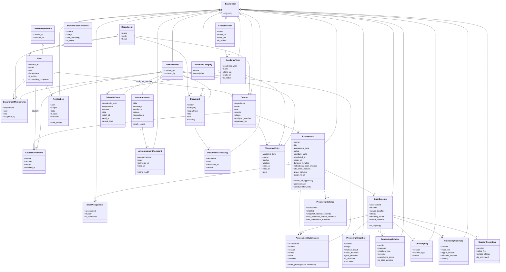

# Class Diagram (Mermaid)

```mermaid
classDiagram
    class TimeStampedModel {
      +created_at
      +updated_at
    }

    class BaseModel {
      +id(UUID)
    }

    class OwnedModel {
      +created_by
      +updated_by
    }

    class User {
      +external_id
      +email
      +role
      +department
      +is_active
      +onboarding_completed
    }

    class Department {
      +name
      +code
      +head
    }

    class DepartmentMembership {
      +department
      +user
      +role
      +assigned_by
    }

    class Course {
      +department
      +code
      +title
      +credits
      +status
      +assigned_teacher
      +approved_by
    }

    class CourseEnrollment {
      +course
      +student
      +status
      +enrolled_at
    }

    class Assessment {
      +course
      +title
      +assessment_type
      +status
      +schedule_state
      +scheduled_at
      +closes_at
      +duration_minutes
      +instructions_open_minutes
      +late_entry_minutes
      +grace_minutes
      +assign_to_all
      +submit_for_approval()
      +approve(user)
      +schedule(start,end)
    }

    class ExamAssignment {
      +assessment
      +student
      +is_completed
    }

    class ExamSession {
      +assessment
      +student
      +server_deadline
      +status
      +cheating_count
      +saved_answers
      +is_expired()
    }

    class CheatingLog {
      +session
      +incident_type
      +details
    }

    class AssessmentSubmission {
      +assessment
      +student
      +session
      +status
      +score
      +answers
      +mark_graded(score, feedback)
    }

    class StudentFaceReference {
      +student
      +image
      +face_encoding
      +is_active
    }

    class ProctoringSettings {
      +assessment
      +enabled
      +snapshot_interval_seconds
      +max_violations_before_terminate
      +min_confidence_threshold
    }

    class ProctoringSnapshot {
      +session
      +image
      +analysis_result
      +faces_detected
      +gaze_direction
      +is_violation
      +processed
    }

    class ProctoringViolation {
      +session
      +snapshot
      +violation_type
      +severity
      +confidence_score
      +is_false_positive
    }

    class ProctoringVideoClip {
      +session
      +video_file
      +trigger_reason
      +duration_seconds
      +severity
    }

    class SessionRecording {
      +session
      +video_file
      +upload_status
      +is_encrypted
    }

    class Announcement {
      +title
      +message
      +audience
      +status
      +department
      +course
      +mark_sent()
    }

    class AnnouncementRecipient {
      +announcement
      +user
      +delivered_at
      +read_at
      +mark_read()
    }

    class Notification {
      +user
      +subject
      +body
      +is_read
      +metadata
      +mark_read()
    }

    class DocumentCategory {
      +name
      +description
    }

    class Document {
      +owner
      +category
      +department
      +title
      +file
      +visibility
    }

    class DocumentAccessLog {
      +document
      +user
      +accessed_at
      +action
    }

    class AcademicYear {
      +name
      +starts_on
      +ends_on
      +is_active
    }

    class AcademicTerm {
      +academic_year
      +name
      +starts_on
      +ends_on
      +is_active
    }

    class CalendarEvent {
      +academic_term
      +department
      +course
      +title
      +start_at
      +end_at
      +event_type
    }

    class TimetableEntry {
      +academic_term
      +course
      +teacher
      +weekday
      +starts_at
      +ends_at
      +room
    }

    TimeStampedModel <|-- User
    BaseModel <|-- OwnedModel
    BaseModel <|-- Department
    BaseModel <|-- Course
    BaseModel <|-- Assessment
    BaseModel <|-- ExamAssignment
    BaseModel <|-- ExamSession
    BaseModel <|-- CheatingLog
    BaseModel <|-- StudentFaceReference
    BaseModel <|-- ProctoringSnapshot
    BaseModel <|-- ProctoringViolation
    BaseModel <|-- ProctoringVideoClip
    BaseModel <|-- SessionRecording
    BaseModel <|-- AnnouncementRecipient
    BaseModel <|-- Notification
    BaseModel <|-- DocumentCategory
    BaseModel <|-- DocumentAccessLog
    BaseModel <|-- AcademicYear
    BaseModel <|-- AcademicTerm
    OwnedModel <|-- AssessmentSubmission
    OwnedModel <|-- Announcement
    OwnedModel <|-- Document
    OwnedModel <|-- DepartmentMembership
    OwnedModel <|-- CourseEnrollment
    OwnedModel <|-- CalendarEvent
    OwnedModel <|-- TimetableEntry

    Department "1" --> "0..*" User : users
    Department "1" --> "0..*" DepartmentMembership
    Department "1" --> "0..*" Course

    User "1" --> "0..*" DepartmentMembership
    User "1" --> "0..*" CourseEnrollment : student
    User "1" --> "0..*" Course : assigned_teacher

    Course "1" --> "0..*" CourseEnrollment
    Course "1" --> "0..*" Assessment

    Assessment "1" --> "0..*" ExamAssignment
    Assessment "1" --> "0..*" ExamSession
    Assessment "1" --> "0..*" AssessmentSubmission
    Assessment "1" --> "0..1" ProctoringSettings

    ExamSession "1" --> "0..*" ProctoringSnapshot
    ExamSession "1" --> "0..*" ProctoringViolation
    ExamSession "1" --> "0..*" ProctoringVideoClip
    ExamSession "1" --> "0..1" SessionRecording
    ExamSession "1" --> "0..1" AssessmentSubmission
    ExamSession "1" --> "0..*" CheatingLog

    Announcement "1" --> "0..*" AnnouncementRecipient
    User "1" --> "0..*" Notification

    DocumentCategory "1" --> "0..*" Document
    Department "1" --> "0..*" Document
    Document "1" --> "0..*" DocumentAccessLog

    AcademicYear "1" --> "0..*" AcademicTerm
    AcademicTerm "1" --> "0..*" CalendarEvent
    AcademicTerm "1" --> "0..*" TimetableEntry
    Course "1" --> "0..*" TimetableEntry
```
