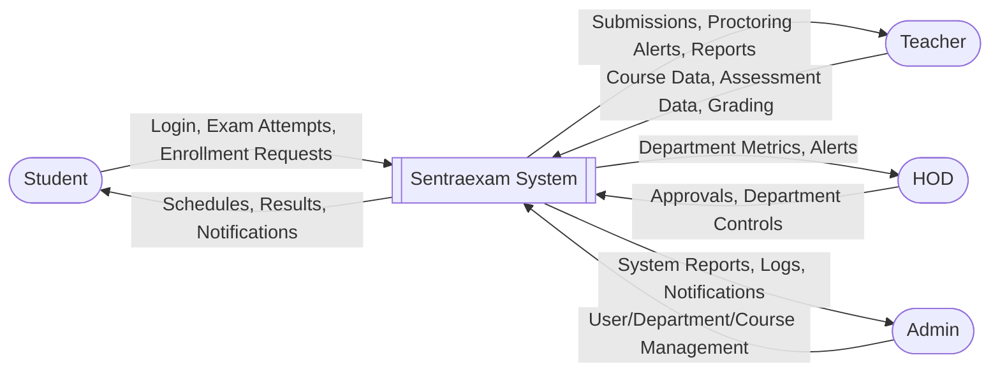
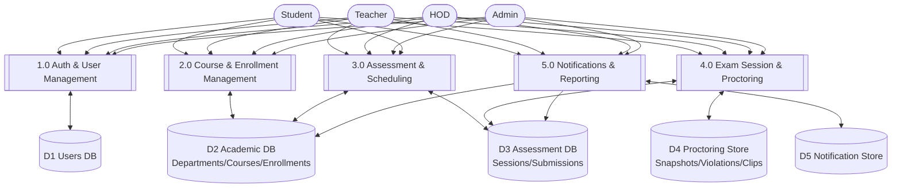
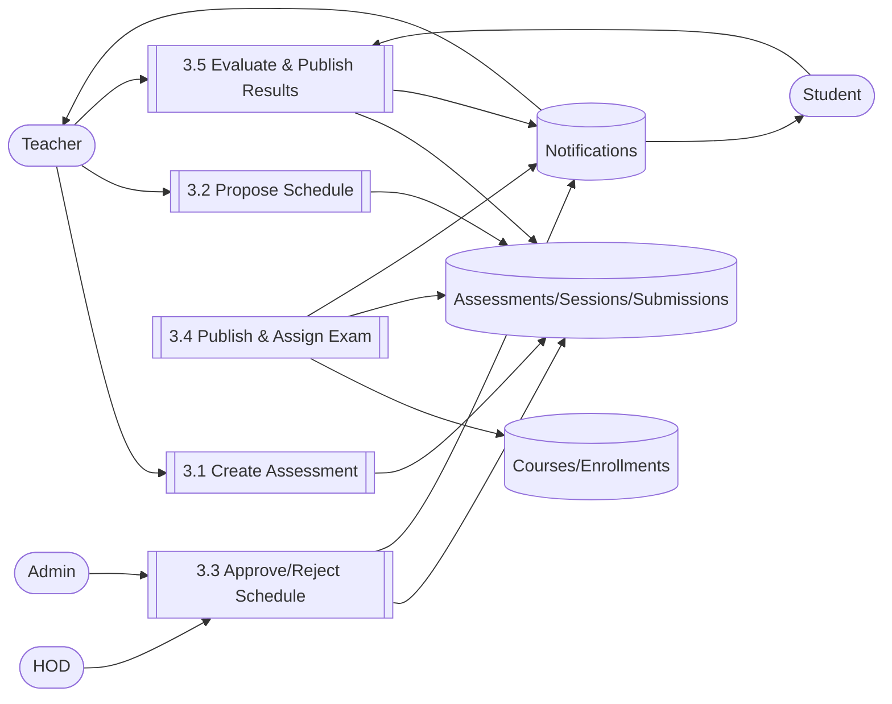

# DFD (Data Flow Diagram) - Sentraexam

## Level 0 (Context Diagram)

```mermaid
flowchart LR
    Student([Student])
    Teacher([Teacher])
    HOD([HOD])
    Admin([Admin])

    System[[Sentraexam System]]

    Student -->|Login, Exam Attempts, Enrollment Requests| System
    System -->|Schedules, Results, Notifications| Student

    Teacher -->|Course Data, Assessment Data, Grading| System
    System -->|Submissions, Proctoring Alerts, Reports| Teacher

    HOD -->|Approvals, Department Controls| System
    System -->|Department Metrics, Alerts| HOD

    Admin -->|User/Department/Course Management| System
    System -->|System Reports, Logs, Notifications| Admin
```

## Level 1

```mermaid
flowchart TB
    Student([Student])
    Teacher([Teacher])
    HOD([HOD])
    Admin([Admin])

    P1[[1.0 Auth & User Management]]
    P2[[2.0 Course & Enrollment Management]]
    P3[[3.0 Assessment & Scheduling]]
    P4[[4.0 Exam Session & Proctoring]]
    P5[[5.0 Notifications & Reporting]]

    D1[(D1 Users DB)]
    D2[(D2 Academic DB\nDepartments/Courses/Enrollments)]
    D3[(D3 Assessment DB\nSessions/Submissions)]
    D4[(D4 Proctoring Store\nSnapshots/Violations/Clips)]
    D5[(D5 Notification Store)]

    Student --> P1
    Teacher --> P1
    HOD --> P1
    Admin --> P1
    P1 <--> D1

    Student --> P2
    Teacher --> P2
    HOD --> P2
    Admin --> P2
    P2 <--> D2

    Teacher --> P3
    HOD --> P3
    Admin --> P3
    Student --> P3
    P3 <--> D3
    P3 <--> D2

    Student --> P4
    Teacher --> P4
    HOD --> P4
    Admin --> P4
    P4 <--> D3
    P4 <--> D4

    Student --> P5
    Teacher --> P5
    HOD --> P5
    Admin --> P5
    P5 <--> D5
    P5 --> D3
    P5 --> D2
```

## Level 2 (3.0 Assessment & Scheduling)

```mermaid
flowchart LR
    Teacher([Teacher])
    HOD([HOD])
    Admin([Admin])
    Student([Student])

    P31[[3.1 Create Assessment]]
    P32[[3.2 Propose Schedule]]
    P33[[3.3 Approve/Reject Schedule]]
    P34[[3.4 Publish & Assign Exam]]
    P35[[3.5 Evaluate & Publish Results]]

    D2[(Courses/Enrollments)]
    D3[(Assessments/Sessions/Submissions)]
    D5[(Notifications)]

    Teacher --> P31
    P31 --> D3

    Teacher --> P32
    P32 --> D3

    HOD --> P33
    Admin --> P33
    P33 --> D3
    P33 --> D5

    P34 --> D2
    P34 --> D3
    P34 --> D5

    Student --> P35
    Teacher --> P35
    P35 --> D3
    P35 --> D5

    D5 --> Student
    D5 --> Teacher
```
