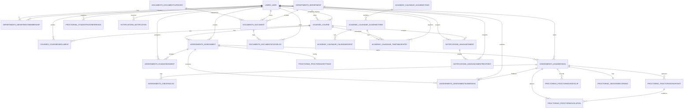

# ER Diagram (Mermaid)

```mermaid
erDiagram
    USERS_USER ||--o{ DEPARTMENTS_DEPARTMENTMEMBERSHIP : has
    DEPARTMENTS_DEPARTMENT ||--o{ DEPARTMENTS_DEPARTMENTMEMBERSHIP : contains

    DEPARTMENTS_DEPARTMENT ||--o{ COURSES_COURSE : owns
    USERS_USER ||--o{ COURSES_COURSE : assigned_teacher
    USERS_USER ||--o{ COURSES_COURSEENROLLMENT : enrolls
    COURSES_COURSE ||--o{ COURSES_COURSEENROLLMENT : has

    COURSES_COURSE ||--o{ ASSESSMENTS_ASSESSMENT : has
    USERS_USER ||--o{ ASSESSMENTS_ASSESSMENT : creates
    USERS_USER ||--o{ ASSESSMENTS_EXAMASSIGNMENT : assigned
    ASSESSMENTS_ASSESSMENT ||--o{ ASSESSMENTS_EXAMASSIGNMENT : assigns

    ASSESSMENTS_ASSESSMENT ||--o{ ASSESSMENTS_EXAMSESSION : starts
    USERS_USER ||--o{ ASSESSMENTS_EXAMSESSION : takes
    ASSESSMENTS_EXAMSESSION ||--o{ ASSESSMENTS_CHEATINGLOG : logs

    ASSESSMENTS_ASSESSMENT ||--o{ ASSESSMENTS_ASSESSMENTSUBMISSION : receives
    USERS_USER ||--o{ ASSESSMENTS_ASSESSMENTSUBMISSION : submits
    ASSESSMENTS_EXAMSESSION ||--|| ASSESSMENTS_ASSESSMENTSUBMISSION : finalizes

    ASSESSMENTS_EXAMSESSION ||--o{ PROCTORING_PROCTORINGSNAPSHOT : captures
    ASSESSMENTS_EXAMSESSION ||--o{ PROCTORING_PROCTORINGVIOLATION : detects
    PROCTORING_PROCTORINGSNAPSHOT ||--o{ PROCTORING_PROCTORINGVIOLATION : evidence
    ASSESSMENTS_EXAMSESSION ||--o{ PROCTORING_PROCTORINGVIDEOCLIP : records
    ASSESSMENTS_EXAMSESSION ||--|| PROCTORING_SESSIONRECORDING : has
    ASSESSMENTS_ASSESSMENT ||--|| PROCTORING_PROCTORINGSETTINGS : config
    USERS_USER ||--o{ PROCTORING_STUDENTFACEREFERENCE : registers

    USERS_USER ||--o{ NOTIFICATIONS_NOTIFICATION : receives
    NOTIFICATIONS_ANNOUNCEMENT ||--o{ NOTIFICATIONS_ANNOUNCEMENTRECIPIENT : targets
    USERS_USER ||--o{ NOTIFICATIONS_ANNOUNCEMENTRECIPIENT : recipient
    DEPARTMENTS_DEPARTMENT ||--o{ NOTIFICATIONS_ANNOUNCEMENT : scoped
    COURSES_COURSE ||--o{ NOTIFICATIONS_ANNOUNCEMENT : scoped

    DOCUMENTS_DOCUMENTCATEGORY ||--o{ DOCUMENTS_DOCUMENT : categorizes
    USERS_USER ||--o{ DOCUMENTS_DOCUMENT : owns
    DEPARTMENTS_DEPARTMENT ||--o{ DOCUMENTS_DOCUMENT : scoped
    DOCUMENTS_DOCUMENT ||--o{ DOCUMENTS_DOCUMENTACCESSLOG : logs
    USERS_USER ||--o{ DOCUMENTS_DOCUMENTACCESSLOG : actor

    ACADEMIC_CALENDAR_ACADEMICYEAR ||--o{ ACADEMIC_CALENDAR_ACADEMICTERM : contains
    ACADEMIC_CALENDAR_ACADEMICTERM ||--o{ ACADEMIC_CALENDAR_CALENDAREVENT : has
    ACADEMIC_CALENDAR_ACADEMICTERM ||--o{ ACADEMIC_CALENDAR_TIMETABLEENTRY : has
    COURSES_COURSE ||--o{ ACADEMIC_CALENDAR_TIMETABLEENTRY : scheduled
    USERS_USER ||--o{ ACADEMIC_CALENDAR_TIMETABLEENTRY : teaches
```
