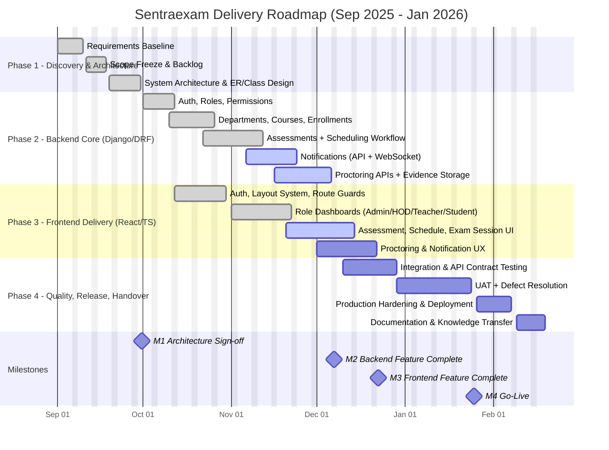

# Professional Gantt Chart - Sentraexam Delivery Plan (September to January)

This plan is structured by phase, includes dependencies, and highlights release milestones.

## Status Legend
- `done`: completed
- `active`: in progress
- no status tag: planned
