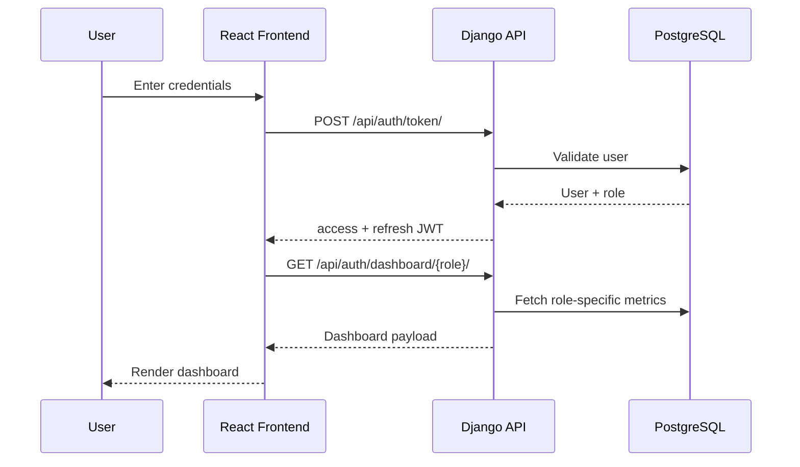
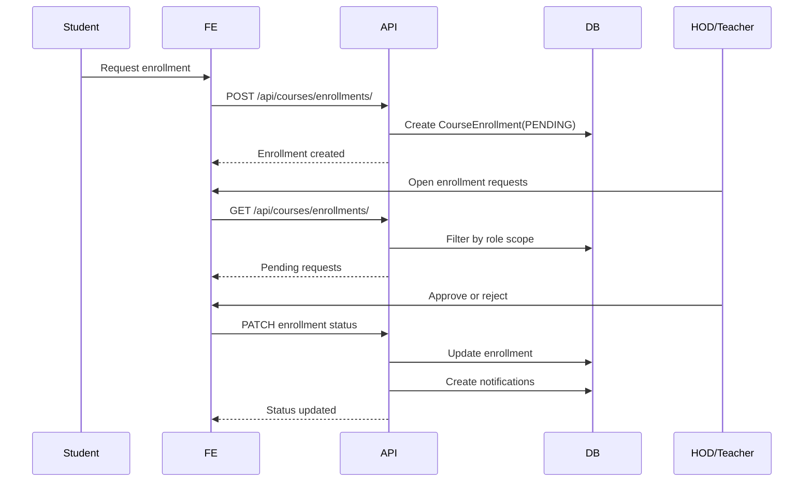
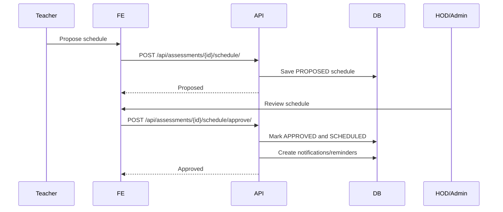
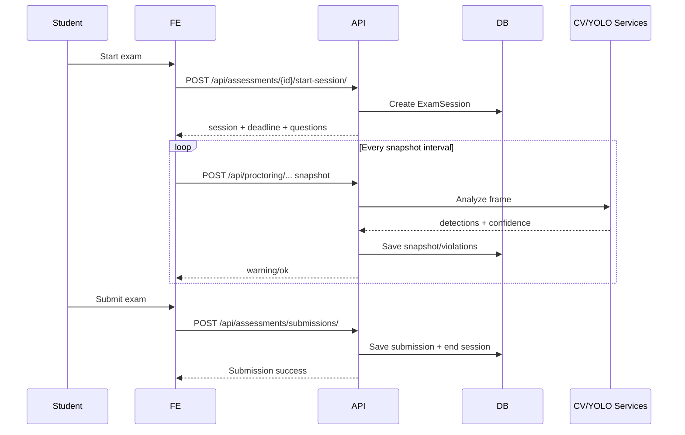
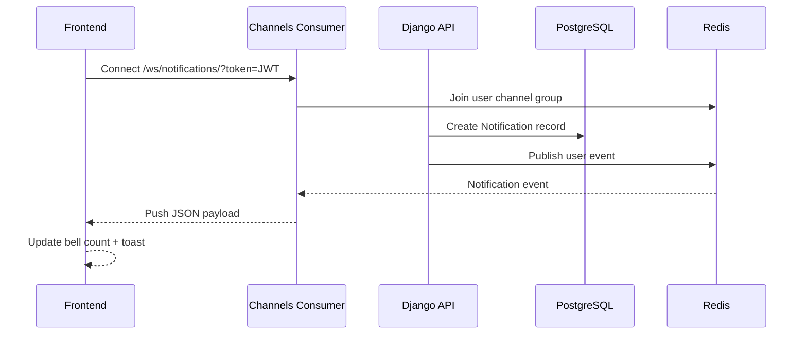

# Sequence Diagrams (Mermaid)

## 1) Login and Dashboard Load

## 2) Enrollment Approval Flow

## 3) Assessment Scheduling and Approval

## 4) Exam Session and Proctoring

## 5) Real-Time Notification Delivery

