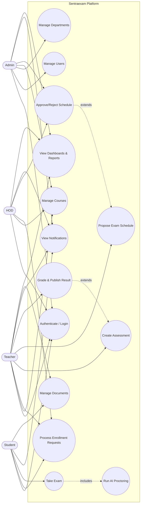

# UML Use Case Diagram - Sentraexam

```mermaid
flowchart LR
    Admin([Admin])
    HOD([HOD])
    Teacher([Teacher])
    Student([Student])

    subgraph UMS[Sentraexam Platform]
      UC1((Authenticate / Login))
      UC2((Manage Users))
      UC3((Manage Departments))
      UC4((Manage Courses))
      UC5((Process Enrollment Requests))
      UC6((Create Assessment))
      UC7((Propose Exam Schedule))
      UC8((Approve/Reject Schedule))
      UC9((Take Exam))
      UC10((Run AI Proctoring))
      UC11((Grade & Publish Result))
      UC12((View Notifications))
      UC13((Manage Documents))
      UC14((View Dashboards & Reports))
    end

    Admin --> UC1
    Admin --> UC2
    Admin --> UC3
    Admin --> UC4
    Admin --> UC8
    Admin --> UC12
    Admin --> UC14

    HOD --> UC1
    HOD --> UC4
    HOD --> UC5
    HOD --> UC8
    HOD --> UC12
    HOD --> UC14

    Teacher --> UC1
    Teacher --> UC4
    Teacher --> UC5
    Teacher --> UC6
    Teacher --> UC7
    Teacher --> UC11
    Teacher --> UC12
    Teacher --> UC13
    Teacher --> UC14

    Student --> UC1
    Student --> UC5
    Student --> UC9
    Student --> UC12
    Student --> UC13

    UC9 -. includes .-> UC10
    UC8 -. extends .-> UC7
    UC11 -. extends .-> UC6
```
