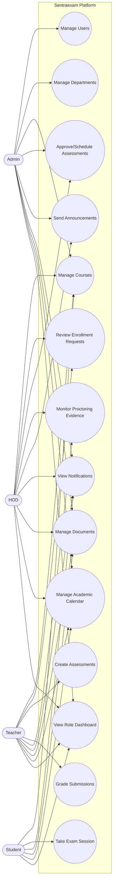

# Use Case Diagram

## Scope Notes
- Assessment statistics and grading are teacher/HOD/admin scoped by permissions.
- Students can only access their own enrollment, sessions, submissions, notifications, and permitted resources.
- Department and course visibility are role and ownership constrained in backend querysets.
